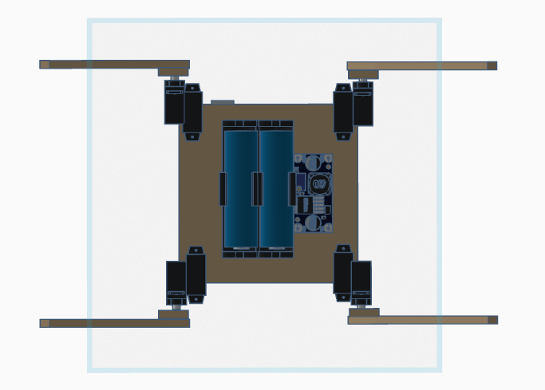

# Quadruped Robot Spider

  
  

## Project Description
This project showcases a four-legged robotic spider powered by an Arduino Mega 2560. Each leg has two degrees of freedom, controlled by a total of 8 servo motors, managed using a PCA9685 PWM servo driver.  
The robot is designed for basic walking motion and can be further developed for more complex movements and interactions.  
The chassis is handcrafted from wood, without the use of a 3D printer. 
The project includes the code, circuit diagram, and 3D model created in Tinkercad.

## Components

- Arduino Mega 2560 or compatible
- 8x SG90 Micro Servo Motors
- PCA9685 16-Channel 12-Bit PWM Servo Driver
- 9V battery (for the microcontroller)
- 2x 18650 2400mAh 20A batteries (for the motors)
- DC-DC 5A Step-Down Converter
- Chassis
- Jumper Wires

## Power Supply

I decided to use a classic 9V battery to power the microcontroller and 2x 18650 2400mAh 20A batteries in series for the motors, voltage regulated with the DC-DC 5A step-down converter (from 7.4V to 5.5V).

## Circuit Diagram

## 3D Model

You can access the 3D model made with Tinkercad [here](https://www.tinkercad.com/things/70gRKuKD6Hh-arduino-quadruped-spider).

  
  
  

## Code

The complete source code is available in the [main.ino](main.ino)  file.

